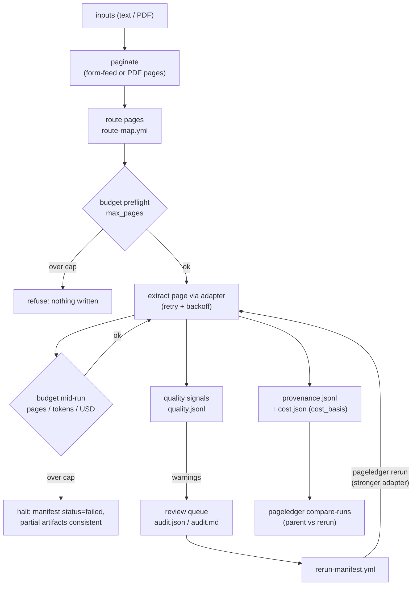

# PageLedger: auditable OCR and document extraction runs

<p align="center">
  <picture>
    <source media="(prefers-color-scheme: dark)" srcset="https://raw.githubusercontent.com/peterbussch/pageledger/main/assets/pageledger-lockup-horizontal-reversed.png">
    
  </picture>
</p>

<p align="center"><em>Record, route, and review document extraction: one page at a time.</em></p>

<p align="center">
  <a href="https://pypi.org/project/pageledger/"></a>
  <a href="https://github.com/peterbussch/pageledger/actions/workflows/ci.yml"></a>
  <a href="https://pypi.org/project/pageledger/"></a>
  <a href="https://github.com/peterbussch/pageledger/blob/main/LICENSE"></a>
  <a href="https://doi.org/10.5281/zenodo.21340651"></a>
</p>

You OCR'd three thousand archive pages last spring. Which engine did page
341 go through, what did the run cost, which pages were too noisy to
trust, and which ones still needed review? PageLedger is a run ledger for
document extraction that keeps those answers on disk: you bring the
engine (Tesseract, Docling, Marker, a cloud VLM), it produces structural
page routes or applies configured/reviewed ones, enforces page/token/dollar
budgets, and writes the
evidence as plain files you can grep, cite, and use to reconstruct the
recorded methodology. No service, no database.

It grew out of a Soviet census digitization project, where "the model
returned JSON" was the beginning of the work, not the end. It is built
for people with the same problem: digital humanities labs, archives,
historians, and anyone who has to defend their methodology months later.

## Install

```bash
pip install pageledger
```

## Quickstart

OCR a scanned PDF. No config file needed; `pdf_ocr` uses your locally
installed Tesseract and poppler (`pageledger doctor` checks for both and
lists your installed OCR languages):

```bash
pageledger run scan.pdf --adapter pdf_ocr --out runs/first
pageledger inspect-run runs/first
```

`runs/first/` now holds the extracted text plus the ledger: a manifest,
per-page provenance, quality warnings, aggregate word-level OCR confidence
evidence, cost evidence, and a review queue. Flagged pages are already listed
in an executable rerun plan, so escalating just those pages to a stronger
engine is one command, and comparing the two runs is another:

```bash
pageledger rerun runs/first --config stronger.yml --out runs/second
pageledger compare-runs runs/first runs/second
pageledger verify-run runs/second
```

Other first moves:

```bash
pageledger run report.pdf --adapter pdf_text --out runs/text   # born-digital PDF (pip install "pageledger[pdf]")
pageledger run scan.pdf --adapter pdf_ocr --out runs/sample --pages "1-10"   # sample before committing
pageledger run scan.pdf --config pageledger.yml --out runs/tuned --dry-run   # inspect routing, spend nothing
pageledger classify scan.pdf --config pageledger.yml --adapter pdf_ocr --out routes.yml  # route proposal + evidence
pageledger run scan.pdf --config pageledger.yml --routes reviewed-routes.yml --out runs/routed
pageledger inspect-run runs/first --csv > pages.csv            # triage in a spreadsheet
```

Non-English documents: set `lang` and `dpi` in the config
(`pageledger init-config --adapter pdf_ocr` writes one with both knobs
visible). See [`docs/multilingual-ocr.md`](docs/multilingual-ocr.md) for a
worked Cyrillic example, including what the signals catch on an 1850 scan.

For layout-aware tables or a fully local VLM escalation, install Docling as a
machine tool (`uv tool install docling`) and use the functional
[`examples/docling_adapter.py`](examples/docling_adapter.py) custom adapter.
It keeps Docling's ML dependencies out of PageLedger core and records the exact
Docling/pipeline identity in page provenance; see
[`docs/adapter-protocol.md`](docs/adapter-protocol.md#local-docling-example).

## How a run works



Every box on the right is a plain file in the run directory.

## What's in the box

- Three built-in adapters (`text`, `pdf_text`, `pdf_ocr`) and a thin
  protocol for wrapping anything else, from OCRmyPDF to a cloud VLM.
- A dependency-free structural classifier that emits executable route maps
  plus per-page evidence for `blank`, `sparse`, `prose`, `table_likely`, and
  `unknown`. Importable hooks supply domain-specific taxonomies.
- Quality signals per page: shape heuristics, Tesseract word confidence
  with a `low_confidence` warning, and pre-1918 Russian orthography
  detection that flags a likely historical-model mismatch, plus conservative
  chat-template leakage and rerun-inflation warnings for model adapters.
- Budgets denominated in pages, the one unit every backend shares, with
  tokens and dollars on top when they exist. Absolute warn thresholds fire
  without a cap and record their first crossing without stopping the run.
- Cost records that name their basis, so a derived estimate is never
  mistaken for provider-billed spend, plus extracted-page rollups by adapter
  and routed page type.
- Schema alignment: declare columns, aliases, types, and arithmetic checks
  once, and structured extractor output (markdown tables, JSON, CSV)
  becomes normalized records. Coercion failures and failed checks are
  recorded, never silently fixed. Structural loss such as duplicate headers,
  uneven rows, and ignored tables is recorded too. `pageledger align` can
  preview or apply a revised schema without re-extracting (or re-paying).
- Per-page grades (A–F) that combine text signals with schema evidence and
  always name their basis. `A (signals)` and `A (schema)` are different
  claims. `review_below_grade: C` turns grades into a review queue.
- Conditional page policies under `run.rerun_if` and `run.quarantine_if`
  act on grades, missing required columns, and arithmetic failure rates.
  Quarantined pages keep their audit evidence but stay out of rerun plans.
- Classify/review/execute routing: `pageledger classify` produces per-page
  type/action/prompt decisions, and `run --routes` accepts that map unchanged
  (or one from a human/external classifier), validates complete source
  coverage, and preserves the routing evidence.
- Optional continue-on-page-error behavior with a consecutive-failure circuit
  breaker. Failed and unattempted pages become auditable rerun work rather than
  disappearing behind the first exception.
- Page-scoped reruns with lineage and optional generation-indexed adapter
  chains; provenance-aware cross-run diffs, runtime ledger verification, CSV
  export, and environment diagnostics.
- JSON Schemas for JSON/JSONL artifacts, shipped in source and wheel
  distributions, plus field-contract tests for YAML, enforced in CI, and an
  [`AGENTS.md`](AGENTS.md) so AI coding agents can operate the tool and
  validate their own output.

Classification is an explicit, inspectable stage: ordinary `run` commands do
not invoke it automatically. Adapter chains escalate across rerun generations,
not as same-run exception fallback.
The full honest-scope list is in
[`docs/capabilities-and-limits.md`](docs/capabilities-and-limits.md).

## Tested on

Real documents, with walkthroughs: a 107-page declassified JFK-files scan
(free Tesseract pass, then a free local-LLM cleanup tier, then a paid
cloud VLM on the pages that needed it), a modern 259-page Russian report,
and an 1850 military-statistical review in pre-reform orthography that
the quality signals flagged page by page. Synthetic stress runs cover
5,000 pages at ~2,100 pages/sec. Details in
[`docs/capabilities-and-limits.md`](docs/capabilities-and-limits.md#tested-scale-and-documents).

## Documentation

| | |
|---|---|
| [`docs/README.md`](docs/README.md) | Documentation index |
| [`docs/cli.md`](docs/cli.md) | All nine commands, flags, and config keys |
| [`docs/classifier.md`](docs/classifier.md) | Structural signals, thresholds, hooks, and route evidence |
| [`docs/artifacts.md`](docs/artifacts.md) | What each file in a run directory answers |
| [`docs/capabilities-and-limits.md`](docs/capabilities-and-limits.md) | What works, what you supply, what is design |
| [`docs/ocr-options.md`](docs/ocr-options.md) | Choosing local, cloud, or hybrid extraction |
| [`docs/multilingual-ocr.md`](docs/multilingual-ocr.md) | Non-English and historical documents |
| [`docs/examples/jfk-scanned-archive.md`](docs/examples/jfk-scanned-archive.md) | Worked example: scan → flags → rerun → compare |
| [`docs/adapter-protocol.md`](docs/adapter-protocol.md) | Wrapping your own OCR/VLM engine |
| [`docs/design.md`](docs/design.md) | Why pages, design principles, and what comes next |
| [`docs/comparison.md`](docs/comparison.md) | Positioning against the 2026 extraction ecosystem |
| [`schemas/`](schemas/) | JSON Schemas, the machine-readable artifact contract |

## Contributing

Testing a collection we haven't seen? [Open a corpus
report](https://github.com/peterbussch/pageledger/issues/new?template=corpus-report.yml)
with the script, adapter, page count, and a redacted sample — real
collections are how the quality signals improve. Development setup and
guidelines are in [CONTRIBUTING.md](CONTRIBUTING.md).

## Citing

Software citation lives in [`CITATION.cff`](CITATION.cff). PageLedger
keeps software and source-data citations separate; `dataset_citation` in
the config records the latter into every manifest.

MIT license.
