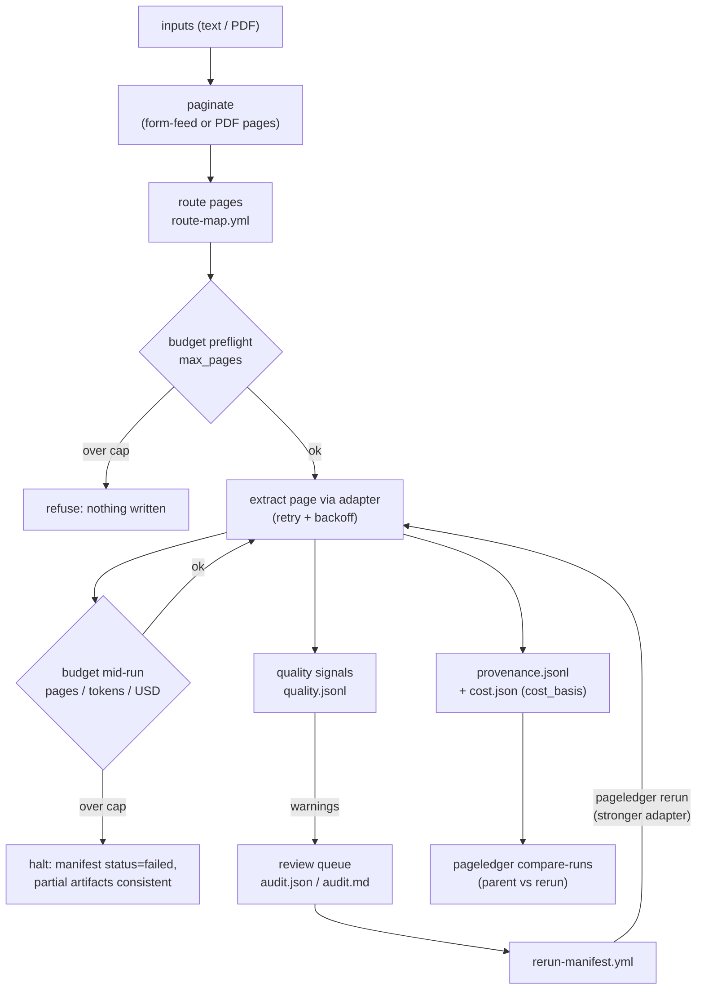

<p align="center">
  <picture>
    <source media="(prefers-color-scheme: dark)" srcset="https://raw.githubusercontent.com/peterbussch/pageledger/main/assets/pageledger-lockup-horizontal-reversed.png">
    
  </picture>
</p>

<p align="center"><em>Record, route, and review document extraction — one page at a time.</em></p>

**PageLedger is for researchers who extract text from archives at scale** —
digital humanities labs, libraries, historians, and social scientists running
OCR/VLM over thousands of scanned pages who must be able to answer, months
later: which pages went through which engine and prompt, what it cost, which
pages are suspect, and what happened when they were re-extracted.

It is a page-denominated **run ledger** — not an OCR model, not a
PDF-to-Markdown converter. You bring the extraction engine (Tesseract,
Docling, Marker, a cloud VLM); PageLedger routes pages to it, enforces
page/token/dollar budgets, and writes the evidence as plain files:
provenance, quality diagnostics, cost with its basis, audit queues, and
executable rerun plans. No service, no database — a run directory you can
grep, cite, and reproduce.

PageLedger grew out of
[soviet-corpus](https://github.com/peterbussch/soviet-corpus), a Soviet census
digitization and corpus-linguistics project where those questions had to be
answerable for source citation and methodological review. The run-ledger
layer was extracted from that working pipeline and rebuilt as a standalone,
domain-neutral tool.

`0.1.0` is an early alpha focused on the run-ledger core: built-in `text` and
`pdf_text` (born-digital) adapters, custom adapters via import strings,
dry runs, budgets, quality signals, page-scoped reruns
(`pageledger rerun`), and cross-run diffs (`pageledger compare-runs`). It
does not yet OCR images itself, call network VLMs out of the box,
automatically classify pages, align records to schemas, or compute audit
grades — see [Current Runtime Capabilities](#current-runtime-capabilities).

## Install

```bash
pip install pageledger
```

Optional born-digital PDF text extraction:

```bash
pip install "pageledger[pdf]"
```

## Quickstart

Create a text fixture and a starter config:

```bash
printf 'first page\fsecond page\n' > sample.txt
pageledger init-config --out pageledger.yml
```

Inspect the run without extraction:

```bash
pageledger run sample.txt --config pageledger.yml --out runs/dry --dry-run
```

Run the built-in text adapter, then summarize the run directory:

```bash
pageledger run sample.txt --config pageledger.yml --out runs/text --json
pageledger inspect-run runs/text
```

For a born-digital PDF, install the optional PDF extra and use `pdf_text`:

```bash
pip install "pageledger[pdf]"
cat > pageledger-pdf.yml <<'YAML'
schema_version: "0.1"
taxonomy:
  page_types:
    prose:
      default_action: transcribe_text
run:
  adapter: pdf_text
YAML
pageledger run document.pdf --config pageledger-pdf.yml --out runs/pdf-dry --dry-run
pageledger run document.pdf --config pageledger-pdf.yml --out runs/pdf-text --json
```

`--out` must point to a new empty directory. For dry runs over PDFs, PageLedger
uses `pypdf` page counts when the PDF extra is installed; execution with
`pdf_text` extracts an existing text layer and does not OCR scanned images.

The run directory contains `manifest.json`, `route-map.yml`, `audit.json`,
`audit.md`, `provenance.jsonl`, `quality.jsonl`, `cost.json`, `run.log`,
`rerun-manifest.yml`, and per-page raw output under `raw/`.

For a real PDF/OCR walkthrough, see
[`docs/pdf-ocr-first-run.md`](docs/pdf-ocr-first-run.md). For local, free,
open-source, cloud, and hybrid extraction choices, see
[`docs/ocr-options.md`](docs/ocr-options.md). Custom adapter examples live
under [`examples/`](examples/), including Tesseract via `pdftoppm`, OCRmyPDF
preprocessing, and a redacted cloud/VLM skeleton.

## How a Run Works



Every box on the right is a plain file in the run directory; nothing needs a
service or database.

## Current Runtime Capabilities

**Built-in and tested:**

- `pageledger run` for text fixtures (form-feed pagination) and born-digital PDF
  text layers (via `pageledger[pdf]`).
- Dry-run mode that generates full run artifacts without calling extractors.
- Per-page provenance (`provenance.jsonl`), quality diagnostics
  (`quality.jsonl`), cost rollups (`cost.json`), structured run logs
  (`run.log`), and audit/review queues (`audit.json`, `audit.md`).
- Page-denominated budget enforcement (pages, tokens, dollars) with preflight
  and per-page caps.
- Retry with configurable `max_retries` and optional exponential backoff
  (`retry.backoff: exponential`).
- `pageledger rerun` — re-extracts exactly the pages listed in a previous
  run's rerun manifest (typically with a stronger adapter), preserving page
  ids, recording parent lineage, enforcing `max_rerun_depth`, and warning if
  a source file changed since the parent run.
- `pageledger compare-runs` — page-by-page diff of two runs: character/word
  deltas, warnings resolved or introduced, adapters, and cost.
- Cost provenance: `cost.json` records `cost_basis` (`adapter_reported`,
  `configured_rate`, `mixed`, or `none`) so derived accounting rates are
  never mistaken for provider-billed spend, plus runner-measured
  `extraction_seconds` per page and in total.
- `pageledger doctor` diagnostics for optional PDF/OCR/cloud tooling.
- Configurable custom adapters via `module.path:object` import strings.

**Adapter-supported but user-supplied:**

- OCR via Tesseract (external `pdftoppm` + `tesseract` commands), OCRmyPDF
  preprocessing, or any external engine wrapped as a custom adapter.
- Cloud OCR/VLM adapters (user provides API keys, adapter code, and pricing).
- Local document-conversion engines (Docling, Marker, Surya) through custom
  adapters.
- PDF page counting for custom adapters that expose `page_count(source)`.

**Documented future work (not yet implemented):**

- Automatic page classification (the alpha routes every page to `review` in
  dry-run mode; no classifier ships).
- Schema alignment execution (the schema config section is parsed but the
  aligner does not yet produce normalized records).
- Audit grading (review queues are populated but no grades are computed).
- Multi-adapter routing chains, `rerun_if`/`quarantine_if` policy enforcement,
  and staged CLI commands (`classify`, `extract`, `align`, `audit`).

## Known Limits

- **`pdf_text` reads existing text layers.** It does not perform OCR. Scanned
  PDFs, image-heavy PDFs, or PDFs with noisy/absent text layers need an external
  OCR step (OCRmyPDF, Tesseract, Docling, Marker, Surya, or cloud OCR) before
  PageLedger can record useful text.
- **Quality signals are diagnostic, not calibrated.** `quality.jsonl` records
  per-page evidence: character/word counts, replacement characters, control
  characters, suspicious symbol density, and embedded-text deltas. A six-item
  warning taxonomy (empty_text, short_text, replacement_characters,
  control_characters, suspicious_symbol_density, suspicious_embedded_text_delta)
  flags pages for review. These signals are NOT OCR accuracy scores — they are
  evidence a human should weigh.
- **Quality-warning pages appear in the audit review queue.** For execution
  runs, every page with one or more quality warnings is added to
  `audit.json` → `review_queue` with reason `"quality_warning"`. Dry-run
  review entries use route-based reasons (`"no_classifier_available"`).
- **No automatic page routing.** Every page routes to the configured
  `default_action` (or `review` in dry-run mode). Projects that need
  page-type-aware routing must classify pages outside PageLedger or wait for
  a future classifier.
- **Schema alignment does not execute.** The schema config section is validated
  and preserved in the config snapshot, but the runner does not yet align
  extractor output to declared columns, types, or checks.
- **Reruns re-extract listed pages; they do not merge results.**
  `rerun-manifest.yml` lists pages from `audit.json` → `review_queue`;
  `pageledger rerun` re-extracts exactly those pages into a new run directory
  with parent lineage. `rerun_status` is `"executable"`, `"empty_queue"`, or
  `"no_further_generations"` (depth cap reached). Combining parent and rerun
  outputs into one corpus remains the project's decision —
  `pageledger compare-runs` shows the per-page evidence for making it.

## Tested Scale

The 0.1.0 alpha has been tested locally on:

- **5,000 synthetic text pages** (2.4s, ~2,100 pages/sec, artifact counts
  verified — raw files = provenance lines = quality lines = pages extracted).
- **1,000 synthetic text pages** (0.25s, ~4,000 pages/sec).
- **72-page born-digital PDF** (via `pageledger[pdf]`).
- **5 small checked-in text fixtures** covering clean, multipage, OCR-noisy,
  blank, and short text.

This is evidence of the envelope, not a universal performance guarantee.
Stress tests are marked `@pytest.mark.stress` and skipped in default CI.
Run them with:

```bash
python -m pytest tests/pageledger/ -m stress
```

## The Canonical Unit: Pages

PageLedger's defining decision is that **the page is the canonical unit of
work.** It is the only unit every extraction backend shares:

- Cloud OCR (Textract, Azure Document Intelligence, Google Document AI, Mistral
  OCR) bills and reports **per page**.
- VLM/LLM extractors expose **tokens** — but only on model-backed paths; tokens
  are meaningless for classical OCR.
- Self-hosted engines (e.g. Docling) have **no dollar cost at all**, only compute
  time.

Because pages are the common denominator, denominating routing, budgeting, and
audit in pages is what lets you **compare, budget, and reproduce a run across
heterogeneous providers** — a Textract run against a Mistral run against a local
model — with one number. Tokens, compute-seconds, and dollars are all carried as
*optional, provider-conditional* signals on top.

Every adapter reports a usage record where **`pages` is required** and
everything else is optional:

```python
usage = {
    "pages": 1,             # REQUIRED — the portable unit
    "tokens": None,         # VLM/LLM paths only
    "compute_seconds": None, # self-hosted engines
    "cost_usd": None,       # optional adapter-reported passthrough
}
```

Dollar cost is **derived by PageLedger, never required of the adapter**, in
priority order: (1) adapter-reported `cost_usd`, (2) configured unit rates
(`cost_per_page` / `cost_per_1k_tokens`), (3) otherwise `null` — the run still
reports raw page counts. Budgets cap on **pages, tokens, or dollars**, whichever
the config sets, because the page count is the only value always present.

## Why Not Just Use OCR?

OCR and document-AI tools are improving quickly. Mistral OCR, Google Document
AI, Azure Document Intelligence, AWS Bedrock Data Automation, Docling, Marker,
Surya, olmOCR, OCR-D, and Unstructured all cover parts of extraction,
conversion, layout analysis, validation, or workflow orchestration.

That makes PageLedger's scope deliberately narrow: it is useful when you need a
local, provider-neutral ledger around those tools, not when you only need one
tool to convert a document once.

| Tool | Strong At | PageLedger Difference |
|---|---|---|
| Mistral OCR | Hosted OCR/document understanding with Markdown and table reconstruction. | PageLedger records why pages went to Mistral, what it cost, and which pages need review or rerun. |
| Google Document AI / Gemini layout parser | Managed OCR, layout parsing, table structure, and RAG-oriented chunking. | PageLedger keeps provider-neutral run artifacts and project-local audit queues outside a cloud workflow. |
| Azure Document Intelligence | Managed text, key-value, table, and field extraction. | PageLedger can track Azure runs beside local or other-provider runs with the same page-denominated manifest. |
| AWS Bedrock Data Automation | Managed classification, extraction, validation, HITL review, and business-rule workflows. | PageLedger stays lighter and filesystem-native for research projects that do not want a cloud stack. |
| Docling | Converting PDFs and documents into structured output. | PageLedger records which pages went to Docling, the usage and cost evidence, and which pages need review or rerun. |
| Marker | High-quality PDF-to-Markdown conversion. | PageLedger handles routing, run manifests, cost controls, and review queues around conversion. |
| Surya | OCR, layout analysis, table recognition. | PageLedger can call Surya as an extractor, then audit the result across a full archive run. |
| olmOCR | LLM-based PDF extraction with document-oriented output. | PageLedger adds page routing, quality diagnostics, cost evidence, and rerun manifests. |
| OCR-D | Mature OCR workflow model with METS/PAGE/ALTO conventions. | PageLedger aims to be lighter, VLM-aware, and friendlier to local research workflows that need JSON/YAML artifacts before full library infrastructure. |
| Unstructured | Document partitioning and preprocessing for downstream use. | PageLedger focuses on extraction run control: what ran, what passed, what failed, what cost money, and what should be rerun. |

Non-goal: PageLedger is not an OCR engine, PDF converter, or layout detector.
If a project already has clean structured text from a single tool and does not
need routing, schema checks, review queues, cost tracking, or reruns, it likely
does not need PageLedger.

For practical provider-agnostic choices, see
[`docs/ocr-options.md`](docs/ocr-options.md). The recommended workflow: run cheap
local extraction first, inspect `quality.jsonl` warnings to identify weak pages,
re-extract just those pages with a stronger adapter via
`pageledger rerun runs/first/ --config stronger.yml --out runs/second/`, then
`pageledger compare-runs runs/first/ runs/second/` to see what improved.

## What PageLedger Cannot Do

PageLedger does not make OCR or VLM output correct by itself. It cannot
calibrate confidence scores across unrelated extractors, guarantee text
accuracy, infer a project's source citation, or make a right-to-left,
mixed-script, tabular, or handwritten collection work without explicit adapter
and schema configuration.

Its job is narrower: preserve enough evidence that a researcher can see what
ran, what failed, what is uncertain, and what should be reviewed or rerun.

## Why This Exists

Modern OCR and document-AI tools can produce impressive text, tables, and
Markdown, but real archive work fails in smaller and more frustrating ways:

- Some pages are title pages, indexes, maps, appendices, blanks, or prose,
  not data pages.
- Expensive VLM calls should be routed deliberately instead of sprayed across
  every page.
- Model-emitted tables often have variant headers, shifted columns, missing
  rows, merged cells, or inconsistent numeric formats.
- Confidence scores are weak unless they are checked against schema,
  arithmetic, page totals, and model agreement.
- Long extraction runs need cost tracking, retry logic, checkpoints, and
  provenance that survives reruns.

PageLedger is for projects where "the model returned JSON" is only the
beginning of the work. The current alpha is for proving local run evidence and
adapter contracts before trusting larger extraction workflows.

## Audience

- Digital humanities labs processing archival scans.
- Libraries and archives building reproducible extraction pipelines.
- Historians and social scientists extracting structured data from source
  books, statistical tables, reports, and registers.
- Civic, legal, nonprofit, and local-government document projects.
- Document-AI engineers who need a lightweight local control plane around
  Docling, Marker, Surya, olmOCR, Tesseract, or API VLMs.

## Architecture and Roadmap

The alpha implements the **run controller** (budgets, retry, provenance,
quality signals, audit queues, rerun execution, cross-run comparison) and
the **adapter protocol** (thin wrappers that accept a routed page and return
serializable content, warnings, confidence hints, and usage metadata — see
[`docs/adapter-protocol.md`](docs/adapter-protocol.md)).

Automatic page routing, schema alignment, audit grading, rerun execution, and
staged CLI commands are design targets, documented with examples in
[`docs/design.md`](docs/design.md).

## CLI

Six commands ship in the alpha; `run` and `rerun` are the ones that extract:

```bash
pageledger run scans/ --config pageledger.yml --out runs/run-001/
pageledger run scans/ --config pageledger.yml --out runs/run-001/ --dry-run
pageledger run scans/ --config pageledger.yml --out runs/run-001/ --json --log-level INFO
pageledger rerun runs/run-001/ --config stronger.yml --out runs/run-002/
                                              # re-extract only the flagged pages
pageledger compare-runs runs/run-001/ runs/run-002/
                                              # page-by-page diff of two runs
pageledger init-config --out pageledger.yml   # write a minimal valid config
pageledger inspect-run runs/run-001/          # summarize a run directory
pageledger doctor --json                      # check optional dependencies
```

`--dry-run` generates the route map and planning artifacts without calling
extractors, so you can inspect routing before spending money or trusting
output. `--json` makes command status scriptable (parseable stdout, errors on
stderr), and `--log-level` controls the detail written to the run log.

Current non-dry-run support is deliberately tiny. Set `run.adapter: text` to
write each page of a UTF-8 text input to `raw/doc_0001_page_0001.txt` (text
sources are split into pages on the form-feed character), or install
`pageledger[pdf]` and set `run.adapter: pdf_text` for born-digital PDF text
extraction through `pypdf`. Both paths emit one `provenance.jsonl` line per
page. This proves the preflight paginate → route → extract → provenance path
before OCR/VLM integrations. For scanned PDFs or richer layout extraction, run
an OCR/conversion tool first or point `run.adapter` at a project adapter such as
`my_project.adapters:TesseractCliAdapter`; PageLedger will keep the same
manifest, cost, log, and provenance envelope around that external engine.

The doctor output reports optional packages, common OCR commands, and whether
cloud OCR/VLM keys are present without printing their values.

Starter config examples live in `docs/examples/`:

- `pageledger.yml` (recommended first-use combined config)
- `page-taxonomy.yml`
- `table-schema.yml`
- `run-policy.yml`

The split files are useful for documentation and larger projects. The
recommended v0.1 user experience should start with one `pageledger.yml` that
contains `taxonomy`, `schema`, and `run` sections.

## Run Artifacts

A run should be inspectable without a database or service:

```text
runs/run-001/
├── manifest.json
├── config-snapshot.yml
├── route-map.yml
├── raw/
│   └── doc_0001_page_0002.txt
├── normalized/
├── audit.json
├── audit.md
├── provenance.jsonl
├── quality.jsonl
├── cost.json
├── run.log
└── rerun-manifest.yml
```

The important artifact is not only the extracted data, but the evidence around
it: which pages were skipped, which model or engine was used, what usage and
cost evidence was observed, which pages failed or need review, and what should
be rerun or reviewed.

`manifest.json` is the canonical run artifact. `audit.md` is a human rendering
of `audit.json`, not a second independent source of truth. Quarantined pages
live in `audit.json` under `quarantine_queue`. `config-snapshot.yml` preserves
the exact user config that produced the run. `run.log` is JSONL — one line per
extractor call with timestamp, `page_id`, adapter, status, and any error — so
partial or failed runs stay greppable. Every artifact validates against the
JSON Schemas in [`schemas/`](schemas/). The artifact directory keeps the name
`normalized/` for stability, but the current alpha does not write normalized
records yet; schema alignment remains a documented design target.

## Design Principles

- Record uncertainty; do not silently fix it.
- Treat heuristic confidence as evidence, not probability. Uncalibrated
  extractors should not imply certainty.
- Every run produces inspectable artifacts on disk.
- Adapters are thin: PageLedger does not own extraction, it owns the process
  around extraction.
- The manifest, route map, and provenance files should be useful without a
  running service or database.
- Preserve separate citations for software and source data.

## Related Documents

- [`schemas/`](schemas/) — JSON Schema files, the machine-readable authority
  for artifact contracts
- [`docs/design.md`](docs/design.md) — design targets: router, schema aligner,
  rerun policies, staged CLI, open research questions
- [`docs/comparison.md`](docs/comparison.md) — positioning against the 2026
  extraction ecosystem
- [`docs/run-manifest-spec.md`](docs/run-manifest-spec.md),
  [`docs/route-map-spec.md`](docs/route-map-spec.md),
  [`docs/audit-spec.md`](docs/audit-spec.md),
  [`docs/provenance-spec.md`](docs/provenance-spec.md),
  [`docs/rerun-manifest-spec.md`](docs/rerun-manifest-spec.md) — per-artifact
  field specs
- [`docs/adapter-protocol.md`](docs/adapter-protocol.md) — how to wrap an
  OCR/VLM tool as an adapter
- [`AGENTS.md`](AGENTS.md) — orientation for AI coding agents working in this
  repository
- [`CITATION.cff`](CITATION.cff) — how to cite PageLedger in research output
