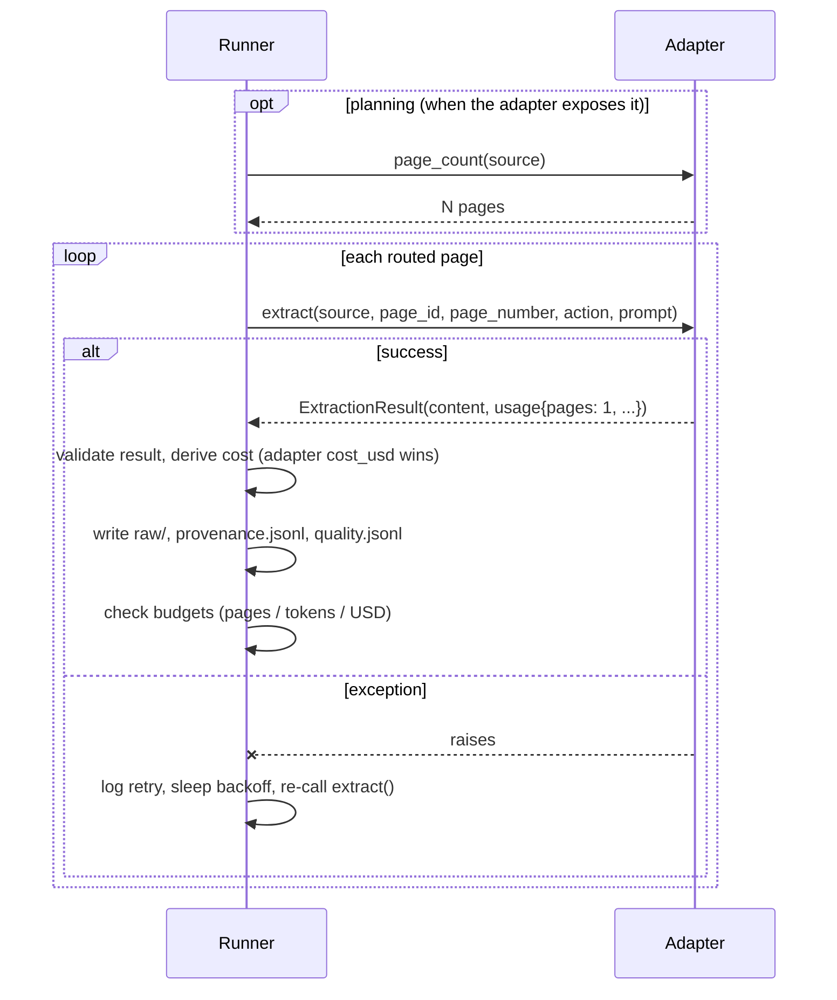

# Extractor adapter protocol

PageLedger calls existing OCR/VLM tools through a small adapter interface.
This keeps the package focused on routing, provenance, audit queues, and
rerun control.

The protocol is frozen for the 0.1 schema version. Patch releases may add
optional attributes; minor releases may add required attributes after a
`schema_version` bump.

## Call sequence



## Python sketch

```python
from dataclasses import dataclass
from pathlib import Path
from typing import Any, Sequence


@dataclass(frozen=True)
class ExtractionResult:
    """Serializable result returned by an extractor adapter."""
    content: str | dict[str, Any] | list[dict[str, Any]]
    format: str  # "text", "markdown", "json", "csv", "markdown_table"
    confidence: float | None
    model: str | None
    warnings: list[str]
    usage: dict[str, Any]  # {"pages": 1, "tokens": int|None, ...}
    confidence_detail: dict[str, Any] | None = None  # engine-native evidence


class ExtractorAdapter:
    """Protocol an adapter object must satisfy.

    All attributes are required for the 0.1 contract.  The conformance
    helper (pageledger.adapters.adapter_conformance_check) validates them.
    """
    name: str
    version: str
    deterministic: bool
    input_types: Sequence[str]      # e.g. ("text",), ("pdf",), ("image",)
    output_types: Sequence[str]     # e.g. ("text",), ("markdown", "json")
    capabilities: Sequence[str]     # e.g. "embedded_text", "ocr", "layout", "tables", "cloud", "local"

    def supports(self, action: str) -> bool:
        """Return True if this adapter can perform the route action."""

    def page_count(self, source: Path) -> int:
        """Optional. Return the source page count when the adapter can know it.
        Must return a positive integer.  Omit or leave absent to fall back
        to the generic paginator."""

    def extract(
        self,
        source: Path,
        *,
        page_id: str,
        page_number: int,
        action: str,
        prompt: str | None = None,
    ) -> ExtractionResult:
        """Extract one routed page.

        Called once per attempt for a page; configured retries may call it
        again after an exception. usage.pages MUST be 1: the canonical unit
        is the page, and each successful call handles one page.
        """
```

The run controller computes `prompt_hash` from the resolved prompt before
calling the adapter. Adapters receive the resolved prompt string; they should
not invent their own prompt hashes.

## The `usage.pages` contract

`usage.pages` **must be exactly 1** for every `extract()` call. PageLedger
calls `extract()` once per page, so the page count is always known from the
runner side. An adapter that reports `usage.pages > 1` or `usage.pages == 0`
causes an `AdapterExecutionError`. This rule is enforced by the runner's
`_validate_extraction_result`.

`usage.tokens`, `usage.compute_seconds`, and `usage.cost_usd` remain optional
and may be `null`.

All result evidence must fit the artifact contract before PageLedger writes
raw output: `confidence` is finite and between 0 and 1, `model` is text or
null, warning items are strings, `confidence_detail` is a JSON-serializable
mapping or null, and numeric usage values are finite numbers rather than
booleans. `NaN` and infinity are rejected at the adapter boundary.

Adapters do **not** have to know dollar prices. Report `cost_usd` only if the
backend returns it directly (e.g. an OpenRouter-style gateway); otherwise leave
it `null` and PageLedger derives cost from configured unit rates
(`run.pricing.cost_per_page` / `cost_per_1k_tokens`), falling back to `null`
when no rate is known.

## Loading custom adapters

The built-in adapters are named `text`, `pdf_text`, and `pdf_ocr`.
Project-specific OCR or VLM wrappers can be loaded with a Python import
string:

```yaml
run:
  adapter: my_project.adapters:TesseractCliAdapter
```

The object after `:` may be an adapter instance, an adapter class, or a
factory function. The resolved adapter is validated for required metadata
(`name`, `version`, `deterministic`, `input_types`, `output_types`,
`capabilities`) and required methods (`supports`, `extract`). Validation
errors include the config key path and expected type. PageLedger never invents
missing metadata: doing so would make provenance claims the adapter did not
make. Classes and factories are constructed once per execution.

If the adapter can count pages before extraction, expose `page_count(source)`
returning a positive integer. Adapters without this hook fall back to the
generic paginator (form-feed for text, 1 page for unknown types, pypdf for PDFs
when the adapter is in `PDF_ADAPTER_NAMES`).

### Adapter options

`run.adapter_options` is a mapping passed to the adapter constructor as
keyword arguments. It works for built-in adapters and for custom classes and
factories:

```yaml
run:
  adapter: pdf_ocr
  adapter_options:
    dpi: 400
    lang: eng+rus
```

An adapter that does not accept a given option fails config validation with
the offending keys named. Options used in a run are recorded in
`manifest.extractors[].options`. Import strings that resolve to an already
constructed *instance* cannot take options: pass a class or factory instead.

### Finding the adapter module

The module in an import string must be importable. Instead of setting
PYTHONPATH, pass the directory with `--adapter-path`:

```bash
pageledger run scan.pdf --config custom.yml --out runs/custom \
  --adapter-path ./my_adapters
```

The directory is prepended to `sys.path` before the config is validated.
`rerun` accepts the same flag.

### Remaining limits

- Async extraction is not supported (the runner is synchronous).
- One adapter instance is shared across the whole run.

## Timeout and subprocess guidance

Adapters that shell out to external commands (e.g. `pdftoppm`, `tesseract`,
`docling`, `marker`, `surya`) must handle subprocess failures explicitly:

- Use `subprocess.run(..., timeout=...)` to avoid hanging indefinitely.
- Catch `subprocess.TimeoutExpired` and re-raise as an `AdapterExecutionError`
  or a descriptive `RuntimeError` so PageLedger can record the failure in
  `run.log` and continue to the next page.
- Capture `stdout` and `stderr` so the error envelope has diagnostic content.
- Do not pass secrets or environment variables to subprocess stdout/stderr
  capture without redaction.

Example pattern:

```python
def extract(self, source, *, page_id, page_number, action, prompt=None):
    try:
        result = subprocess.run(
            ["tesseract", str(source), "stdout", "-l", "eng"],
            capture_output=True, text=True, timeout=30,
        )
        result.check_returncode()
    except subprocess.TimeoutExpired:
        raise RuntimeError(
            f"Tesseract timed out for {page_id} after 30s"
        ) from None
    return ExtractionResult(
        content=result.stdout,
        ...
    )
```

## Adapter conformance helper

Adapter authors can validate their adapter against the protocol contract:

```python
from pageledger.adapters import adapter_conformance_check

issues = adapter_conformance_check(my_adapter)
if issues:
    for issue in issues:
        print(f"  - {issue}")
```

The checker returns a list of conformance issues (empty = passes). It validates:
required attributes and their types, sequence item types, required methods, and
optional `page_count` callability. It does NOT call `extract()` or `supports()`
- those should be tested in project-specific tests.

This function is importable from `pageledger.adapters` and has no dependencies
beyond the Python standard library.

## Result fields

Adapters should return `ExtractionResult` instances with:

| Field | Type | Meaning |
|---|---|---|
| `content` | string or object | Raw extracted content. |
| `format` | string | `markdown`, `json`, `csv`, `text`, or `markdown_table`. |
| `confidence` | number or null | Adapter confidence when available. Serialize null as JSON `null`. |
| `model` | string or null | Model or OCR engine identifier. |
| `warnings` | array | Non-fatal issues (empty list if none). |
| `usage` | object | **`pages` must be 1**; `tokens`, `compute_seconds`, `cost_usd` optional/nullable. |
| `confidence_detail` | object or null | Optional engine-native confidence evidence, adapter-defined shape; recorded into `quality.jsonl` verbatim. `pdf_ocr` fills Tesseract per-word statistics (`scale`, `word_count`, `mean`, `min`, `below_60_count`, `below_60_ratio`). |

## Adapter candidates

- Tesseract / pytesseract for cheap OCR fallback.
- Docling for PDF/document conversion.
- Marker for Markdown extraction.
- Surya for OCR/layout/table recognition.
- olmOCR for LLM-oriented PDF extraction.
- API VLMs through OpenAI-compatible clients.

Built-in adapters: `text`, `pdf_text` (through `pageledger[pdf]`), and
`pdf_ocr` (through locally installed poppler + Tesseract). Anything stronger
is a custom adapter; the adapter contract matters more than adapter breadth.

Copy-paste examples live in `examples/`:

- `tesseract_pdftoppm_adapter.py`
- `cloud_vlm_adapter_skeleton.py`
- `prereform_normalizer_adapter.py`: OCR plus pre-1918 Russian orthography
  canonicalization, with the rewrite recorded as a result warning

For a provider-agnostic tier guide, see `docs/ocr-options.md`.
