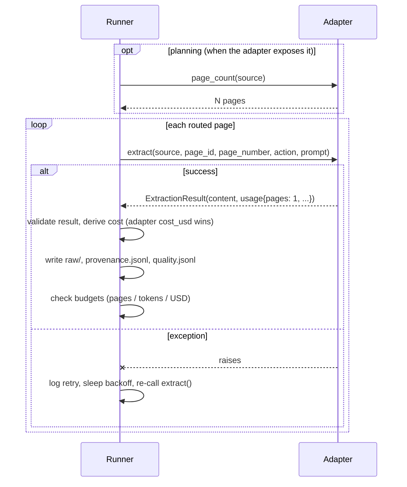

# Extractor Adapter Protocol

PageLedger calls existing OCR/VLM tools through a small adapter interface.
This keeps the package focused on routing, provenance, audit queues, and
rerun control.

The protocol is frozen for the 0.1 schema version. Patch releases may add
optional attributes; minor releases may add required attributes after a
`schema_version` bump.

## Call Sequence



## Python Sketch

```python
from dataclasses import dataclass
from pathlib import Path
from typing import Any, Sequence


@dataclass(frozen=True)
class ExtractionResult:
    """Serializable result returned by an extractor adapter."""
    content: str | dict[str, Any] | list[dict[str, Any]]
    format: str  # "text", "markdown", "json", "csv", "markdown_table"
    confidence: float | None
    model: str | None
    warnings: list[str]
    usage: dict[str, Any]  # {"pages": 1, "tokens": int|None, ...}


class ExtractorAdapter:
    """Protocol an adapter object must satisfy.

    All attributes are required for the 0.1 contract.  The conformance
    helper (pageledger.adapters.adapter_conformance_check) validates them.
    """
    name: str
    version: str
    deterministic: bool
    input_types: Sequence[str]      # e.g. ("text",), ("pdf",), ("image",)
    output_types: Sequence[str]     # e.g. ("text",), ("markdown", "json")
    capabilities: Sequence[str]     # e.g. "embedded_text", "ocr", "layout", "tables", "cloud", "local"

    def supports(self, action: str) -> bool:
        """Return True if this adapter can perform the route action."""

    def page_count(self, source: Path) -> int:
        """Optional. Return the source page count when the adapter can know it.
        Must return a positive integer.  Omit or leave absent to fall back
        to the generic paginator."""

    def extract(
        self,
        source: Path,
        *,
        page_id: str,
        page_number: int,
        action: str,
        prompt: str | None = None,
    ) -> ExtractionResult:
        """Extract one routed page.

        Called exactly once per page.  usage.pages MUST be 1 — the canonical
        unit is the page, and each call handles one page.
        """
```

The run controller computes `prompt_hash` from the resolved prompt before
calling the adapter. Adapters receive the resolved prompt string; they should
not invent their own prompt hashes.

## The `usage.pages` Contract

`usage.pages` **must be exactly 1** for every `extract()` call. PageLedger
calls `extract()` once per page, so the page count is always known from the
runner side. An adapter that reports `usage.pages > 1` or `usage.pages == 0`
causes an `AdapterExecutionError`. This rule is enforced by the runner's
`_validate_extraction_result`.

`usage.tokens`, `usage.compute_seconds`, and `usage.cost_usd` remain optional
and may be `null`.

Adapters do **not** have to know dollar prices. Report `cost_usd` only if the
backend returns it directly (e.g. an OpenRouter-style gateway); otherwise leave
it `null` and PageLedger derives cost from configured unit rates
(`run.pricing.cost_per_page` / `cost_per_1k_tokens`), falling back to `null`
when no rate is known.

## Loading Custom Adapters

The built-in adapters are named `text` and `pdf_text`. Project-specific OCR or
VLM wrappers can be loaded with a Python import string:

```yaml
run:
  adapter: my_project.adapters:TesseractCliAdapter
```

The object after `:` may be an adapter instance, a no-argument adapter class, or
a no-argument factory function. The resolved adapter is validated for required
metadata (`name`, `version`, `deterministic`, `input_types`, `output_types`,
`capabilities`) and required methods (`supports`, `extract`). Validation errors
include the config key path and expected type.

If the adapter can count pages before extraction, expose `page_count(source)`
returning a positive integer. Adapters without this hook fall back to the
generic paginator (form-feed for text, 1 page for unknown types, pypdf for PDFs
when the adapter is in `PDF_ADAPTER_NAMES`).

### Limits of no-arg import adapters

Simple no-argument import-string adapters work for most local tools (Tesseract,
OCRmyPDF wrappers, shell-out scripts). They do NOT support:
- Constructor arguments (the loader calls the class with no args)
- Async extraction (the runner is synchronous)
- Multi-file state (each adapter instance is shared across a run)

For adapters that need configuration, instantiate them in your project code and
pass the instance as `module.path:instance_name`.

## Timeout and Subprocess Guidance

Adapters that shell out to external commands (e.g. `pdftoppm`, `tesseract`,
`docling`, `marker`, `surya`) must handle subprocess failures explicitly:

- Use `subprocess.run(..., timeout=...)` to avoid hanging indefinitely.
- Catch `subprocess.TimeoutExpired` and re-raise as an `AdapterExecutionError`
  or a descriptive `RuntimeError` so PageLedger can record the failure in
  `run.log` and continue to the next page.
- Capture `stdout` and `stderr` so the error envelope has diagnostic content.
- Do not pass secrets or environment variables to subprocess stdout/stderr
  capture without redaction.

Example pattern:

```python
def extract(self, source, *, page_id, page_number, action, prompt=None):
    try:
        result = subprocess.run(
            ["tesseract", str(source), "stdout", "-l", "eng"],
            capture_output=True, text=True, timeout=30,
        )
        result.check_returncode()
    except subprocess.TimeoutExpired:
        raise RuntimeError(
            f"Tesseract timed out for {page_id} after 30s"
        ) from None
    return ExtractionResult(
        content=result.stdout,
        ...
    )
```

## Adapter Conformance Helper

Adapter authors can validate their adapter against the protocol contract:

```python
from pageledger.adapters import adapter_conformance_check

issues = adapter_conformance_check(my_adapter)
if issues:
    for issue in issues:
        print(f"  - {issue}")
```

The checker returns a list of conformance issues (empty = passes). It validates:
required attributes and their types, sequence item types, required methods, and
optional `page_count` callability. It does NOT call `extract()` or `supports()`
— those should be tested in project-specific tests.

This function is importable from `pageledger.adapters` and has no dependencies
beyond the Python standard library.

## Result Fields

Adapters should return `ExtractionResult` instances with:

| Field | Type | Meaning |
|---|---|---|
| `content` | string or object | Raw extracted content. |
| `format` | string | `markdown`, `json`, `csv`, `text`, or `markdown_table`. |
| `confidence` | number or null | Adapter confidence when available. Serialize null as JSON `null`. |
| `model` | string or null | Model or OCR engine identifier. |
| `warnings` | array | Non-fatal issues (empty list if none). |
| `usage` | object | **`pages` must be 1**; `tokens`, `compute_seconds`, `cost_usd` optional/nullable. |

## Adapter Candidates

- Tesseract / pytesseract for cheap OCR fallback.
- Docling for PDF/document conversion.
- Marker for Markdown extraction.
- Surya for OCR/layout/table recognition.
- olmOCR for LLM-oriented PDF extraction.
- API VLMs through OpenAI-compatible clients.

The first public alpha ships deterministic local adapters (`text`, plus optional
`pdf_text` through `pageledger[pdf]`). OCR/VLM adapters come later; the adapter
contract matters more than adapter breadth.

Copy-paste examples live in `examples/`:

- `tesseract_pdftoppm_adapter.py`
- `cloud_vlm_adapter_skeleton.py`

For a provider-agnostic tier guide, see `docs/ocr-options.md`.
