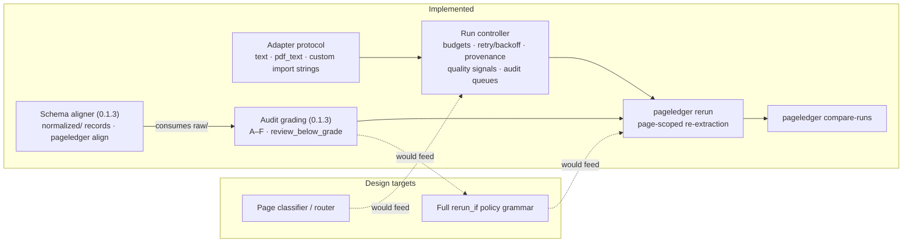

# PageLedger Design Targets

This document holds the intended architecture beyond the current alpha.
Nothing here is a promise: the release contract is what `capabilities-and-limits.md` lists
as built in and what the JSON Schemas in
[`../schemas/`](../schemas/) validate. The `0.1.0` alpha implements the
**run controller** (budgets, retry/backoff, provenance, quality signals,
audit queues, rerun execution, cross-run comparison) and the **adapter
protocol**. `0.1.3` adds the **schema aligner** (§2) and **audit grading**
(A–F per page, plus the `review_below_grade` policy subset). The
classifier-driven router and the full conditional-rerun policy grammar
remain design targets.



## The canonical unit: pages

PageLedger's defining decision is that the page is the canonical unit of
work. It is the only unit every extraction backend shares:

- Cloud OCR (Textract, Azure Document Intelligence, Google Document AI,
  Mistral OCR) bills and reports per page.
- VLM/LLM extractors expose tokens, but only on model-backed paths; tokens
  are meaningless for classical OCR.
- Self-hosted engines (Docling and friends) have no dollar cost at all,
  only compute time.

Because pages are the common denominator, routing, budgeting, and audit in
pages lets you compare a Textract run against a Mistral run against a
local model with one number. Tokens, compute seconds, and dollars ride on
top as optional, provider-conditional signals.

Every adapter reports a usage record where `pages` is required and
everything else is optional:

```python
usage = {
    "pages": 1,              # REQUIRED — the portable unit
    "tokens": None,          # VLM/LLM paths only
    "compute_seconds": None, # self-hosted engines
    "cost_usd": None,        # optional adapter-reported passthrough
}
```

Dollar cost is derived by PageLedger, never required of the adapter, in
priority order: (1) adapter-reported `cost_usd`, (2) configured unit rates
(`cost_per_page` / `cost_per_1k_tokens`), (3) otherwise `null` — the run
still reports raw page counts. Budgets cap on pages, tokens, or dollars,
whichever the config sets, because the page count is the only value always
present.

## Design principles

- Record uncertainty; do not silently fix it.
- Treat heuristic confidence as evidence, not probability. Uncalibrated
  extractors should not imply certainty.
- Every run produces inspectable artifacts on disk.
- Adapters are thin: PageLedger does not own extraction, it owns the
  process around extraction.
- The manifest, route map, and provenance files should be useful without a
  running service or database.
- Preserve separate citations for software and source data.

## 1. Page Router *(design target)*

The router classifies pages before extraction. It emits a route map that
decides which pages should be skipped, sent to cheap OCR, sent to a VLM table
extractor, sent to prose transcription, or queued for review.

Example route map:

```yaml
documents:
  - source: scans/volume_01.pdf
    pages:
      - page_id: doc_0001_page_0001
        page_number: 1
        type: structural_metadata
        action: skip
      - page_id: doc_0001_page_0002
        page_number: 2
        type: table_data
        action: vlm_table
        prompt: table-default-v1
      - page_id: doc_0001_page_0003
        page_number: 3
        type: index
        action: reference_entry
      - page_id: doc_0001_page_0004
        page_number: 4
        type: blank
        confidence: null
        action: skip
```

Page ids follow `doc_{NNNN}_page_{MMMM}`, so a run over many multi-page
sources stays unambiguous. In the current alpha, every page routes to the
configured `default_action` (or `review` in dry-run mode); no classifier
ships.

## 2. Schema Aligner *(shipped in 0.1.3)*

The aligner maps OCR/VLM output to a declared schema. The schema defines
columns, aliases, required fields, type coercions, and arithmetic checks.
It consumes structured page formats — `markdown_table`, `json`, `csv` —
and writes one normalized record file per page to `normalized/`
(see the normalized-page JSON Schema). Plain `text`/`markdown` pages are
not aligned: without declared structure in the payload there is nothing
to map, and guessing would violate the record-uncertainty principle.
Header matching is exact (casefold, collapsed whitespace) against names
and aliases; coercion failures and failed checks are recorded, never
silently fixed. `pageledger align <run-dir> [--schema file.yml]`
re-aligns an existing run from its raw pages without re-extracting.

This is schema alignment, not orthography normalization. Language- or
archive-specific normalization should remain in the project pipeline. The
shipped shape assumes one primary schema per run. Multi-schema routing can
be added later once the single-schema path is boring and reliable.

Example schema:

```yaml
name: demographic_table
columns:
  - name: place_name
    aliases: ["place", "settlement", "locality"]
    type: string
    required: true
  - name: population_total
    aliases: ["total", "population"]
    type: integer
    required: true
  - name: population_male
    aliases: ["male", "men"]
    type: integer
  - name: population_female
    aliases: ["female", "women"]
    type: integer
checks:
  - name: population_sum
    expression: population_total == population_male + population_female
    tolerance: 2
quality:
  minimum_required_column_coverage: 1.0
  low_confidence_threshold: 0.70
```

The `quality` keys are floors for grading: coverage below
`minimum_required_column_coverage` forces the schema axis to F, and a page
confidence under `low_confidence_threshold` caps its grade at C.

## 3. Run Controller *(mostly implemented)*

The controller manages long extraction runs. The current alpha implements
budgets (pages/tokens/dollars, preflight and mid-run), retry with optional
exponential backoff, per-page provenance with measured extraction time,
quality signals, audit/review queues, rerun execution (`pageledger rerun`
consumes the rerun manifest, enforcing `max_rerun_depth`), and cross-run
comparison (`pageledger compare-runs`). Conditional rerun *policies* are the
unimplemented remainder:

Grading shipped in 0.1.3 with one policy knob:
`run.grading.review_below_grade: C` queues pages graded strictly below the
threshold (reason `grade_below_threshold`) and fills `previous_grade` in
the rerun manifest. The full policy grammar remains a design target:

```yaml
# Future (not yet enforced by the runner):
rerun_if:
  - grade_below: C
  - missing_required_columns: true
  - arithmetic_failure_rate_above: 0.05
extractors:
  vlm_table:
    adapter_order:
      - qwen-local
      - gemini-api
      - claude-api
```

Today the rerun queue is whatever landed in `audit.json → review_queue`
(quality warnings, configured-review pages, and grade-threshold pages).

## 4. Staged CLI *(design target)*

Later versions can expose the internal stages as separate commands:

```bash
pageledger classify scans/ --taxonomy page-types.yml --out route-map.yml
pageledger extract scans/ --routes route-map.yml --out runs/run-001/
pageledger audit runs/run-001/ --out runs/run-001/audit.md
```

(`rerun` graduated from this list in the alpha; `align` graduated in
0.1.3 as `pageledger align <run-dir> --schema table.yml`.) The staged
commands are useful for debugging and advanced composition, but they should
not be the default first-use experience — that stays `pageledger run`.

## What It Should Not Do First

- It should not train OCR models.
- It should not replace Docling, Marker, Surya, olmOCR, OCR-D, or Tesseract.
- It should not start with a web UI.
- It should not assume one content domain, language, archive, or schema.
- It should not ship hardcoded provider pricing, page taxonomies, or
  column/header dictionaries.
- It should not include computer-vision fallback heuristics, GIS export,
  dashboards, or ensemble voting in core.
- It should not silently fix uncertain data. Uncertainty should be recorded,
  rerouted, or quarantined for review.

## Open Research Questions

- How should region-level extraction be modeled when a page contains mixed
  content?
- How much of OCR-D/PAGE/ALTO/TEI should be supported in the first release,
  versus deferred to exporters?
- What is the smallest useful adapter interface for third-party OCR/VLM
  tools?
- Should schemas be pure YAML or Python/Pydantic first?
- How should quality scores be calibrated across extractors that do not
  expose comparable confidences? (0.1.3 answers this by *labeling*, not
  calibrating: every rendered grade carries its basis — `A (signals)` vs
  `A (schema)` — and the docs state grades are only comparable within one
  adapter. True cross-extractor calibration remains open.)
