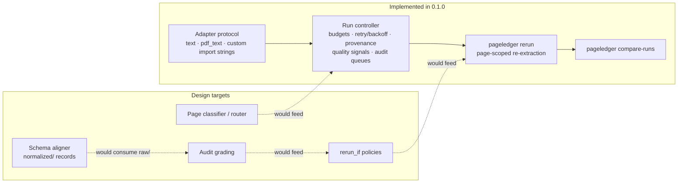

# PageLedger Design Targets

This document holds the intended architecture beyond the current alpha.
Nothing here is a promise: the release contract is what `README.md` lists
under "Current Runtime Capabilities" and what the JSON Schemas in
[`../schemas/`](../schemas/) validate. The `0.1.0` alpha implements the
**run controller** (budgets, retry/backoff, provenance, quality signals,
audit queues, rerun execution, cross-run comparison) and the **adapter
protocol**. The classifier-driven router, schema aligner, audit grading, and
conditional rerun policies described below are design targets.



## 1. Page Router *(design target)*

The router classifies pages before extraction. It emits a route map that
decides which pages should be skipped, sent to cheap OCR, sent to a VLM table
extractor, sent to prose transcription, or queued for review.

Example route map:

```yaml
documents:
  - source: scans/volume_01.pdf
    pages:
      - page_id: doc_0001_page_0001
        page_number: 1
        type: structural_metadata
        action: skip
      - page_id: doc_0001_page_0002
        page_number: 2
        type: table_data
        action: vlm_table
        prompt: table-default-v1
      - page_id: doc_0001_page_0003
        page_number: 3
        type: index
        action: reference_entry
      - page_id: doc_0001_page_0004
        page_number: 4
        type: blank
        confidence: null
        action: skip
```

Page ids follow `doc_{NNNN}_page_{MMMM}`, so a run over many multi-page
sources stays unambiguous. In the current alpha, every page routes to the
configured `default_action` (or `review` in dry-run mode); no classifier
ships.

## 2. Schema Aligner *(design target)*

The aligner maps OCR/VLM output to a declared schema. The schema defines
columns, aliases, required fields, type coercions, validation rules, and
output models. It should work with Markdown tables, JSON, CSV, or table
objects from other libraries.

This is schema alignment, not orthography normalization. Language- or
archive-specific normalization should remain in the project pipeline. The
v0.1 shape assumes one primary schema per run. Multi-schema routing can be
added later once the single-schema path is boring and reliable.

Example schema:

```yaml
name: demographic_table
columns:
  - name: place_name
    aliases: ["place", "settlement", "locality"]
    type: string
    required: true
  - name: population_total
    aliases: ["total", "population"]
    type: integer
    required: true
  - name: population_male
    aliases: ["male", "men"]
    type: integer
  - name: population_female
    aliases: ["female", "women"]
    type: integer
checks:
  - name: population_sum
    expression: population_total == population_male + population_female
    tolerance: 2
quality:
  minimum_required_column_coverage: 1.0
  low_confidence_threshold: 0.70
```

In the current alpha the `schema` config section is validated and preserved
in the config snapshot, but the runner does not produce normalized records;
the run directory's `normalized/` stays empty.

## 3. Run Controller *(mostly implemented)*

The controller manages long extraction runs. The current alpha implements
budgets (pages/tokens/dollars, preflight and mid-run), retry with optional
exponential backoff, per-page provenance with measured extraction time,
quality signals, audit/review queues, rerun execution (`pageledger rerun`
consumes the rerun manifest, enforcing `max_rerun_depth`), and cross-run
comparison (`pageledger compare-runs`). Conditional rerun *policies* are the
unimplemented remainder:

```yaml
# Future (not yet enforced by the runner):
rerun_if:
  - grade_below: C
  - missing_required_columns: true
  - arithmetic_failure_rate_above: 0.05
extractors:
  vlm_table:
    adapter_order:
      - qwen-local
      - gemini-api
      - claude-api
```

Today the rerun queue is whatever landed in `audit.json → review_queue`
(quality warnings and configured-review pages). `rerun_if` would let audit
grades and schema checks feed that queue once grading exists.

## 4. Staged CLI *(design target)*

Later versions can expose the internal stages as separate commands:

```bash
pageledger classify scans/ --taxonomy page-types.yml --out route-map.yml
pageledger extract scans/ --routes route-map.yml --out runs/run-001/
pageledger align runs/run-001/raw/ --schema table.yml --out runs/run-001/normalized/
pageledger audit runs/run-001/ --out runs/run-001/audit.md
```

(`rerun` graduated from this list — it ships in the alpha.) The staged
commands are useful for debugging and advanced composition, but they should
not be the default first-use experience — that stays `pageledger run`.

## What It Should Not Do First

- It should not train OCR models.
- It should not replace Docling, Marker, Surya, olmOCR, OCR-D, or Tesseract.
- It should not start with a web UI.
- It should not assume one content domain, language, archive, or schema.
- It should not ship hardcoded provider pricing, page taxonomies, or
  column/header dictionaries.
- It should not include computer-vision fallback heuristics, GIS export,
  dashboards, or ensemble voting in core.
- It should not silently fix uncertain data. Uncertainty should be recorded,
  rerouted, or quarantined for review.

## Open Research Questions

- How should region-level extraction be modeled when a page contains mixed
  content?
- How much of OCR-D/PAGE/ALTO/TEI should be supported in the first release,
  versus deferred to exporters?
- What is the smallest useful adapter interface for third-party OCR/VLM
  tools?
- Should schemas be pure YAML or Python/Pydantic first?
- How should quality scores be calibrated across extractors that do not
  expose comparable confidences?
