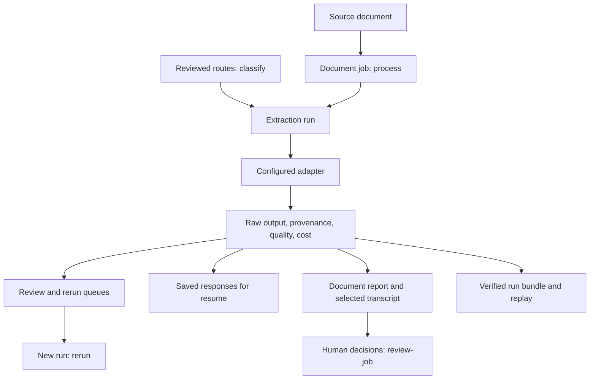

# PageLedger design and targets

PageLedger has two controllers. `run` applies one adapter to routed pages;
`process` coordinates a document's local text, OCR, and optional image attempts.
Both retain page identities and extraction evidence. The
[capabilities and limits](capabilities-and-limits.md) and
[artifact schemas](../schemas/) define the 0.5.0 contract.


```mermaid
flowchart TD
    Source[Source document] --> Job[Document job: process]
    Routes[Reviewed routes: classify] --> Run[Extraction run]
    Job --> Run
    Run --> Adapter[Configured adapter]
    Adapter --> Evidence[Raw output, provenance, quality, cost]
    Evidence --> Review[Review and rerun queues]
    Evidence --> Checkpoint[Saved responses for resume]
    Evidence --> Report[Document report and selected transcript]
    Review --> Rerun[New run: rerun]
    Report --> Human[Human decisions: review-job]
    Evidence --> Bundle[Verified run bundle and replay]
```

The report and human-receipt paths belong to document jobs. Explicit reruns and
portable bundles operate on individual runs. Image-evidence runs cannot be
bundled in this version.

## The canonical unit: pages

The source page is the common unit across local OCR and model-backed
extraction. Routes, attempt counts, review decisions, and reruns all retain that
identity. Tokens, measured time, and dollars are optional usage evidence; many
local engines report no dollar amount.

Every adapter reports a usage record where `pages` is required and
everything else is optional:

```python
usage = {
    "pages": 1,              # REQUIRED: the portable unit
    "tokens": None,          # VLM/LLM paths only
    "compute_seconds": None, # self-hosted engines
    "cost_usd": None,        # optional adapter-reported passthrough
}
```

Dollar cost is resolved by PageLedger in
priority order: (1) adapter-reported `cost_usd`, (2) configured unit rates
(`cost_per_page` / `cost_per_1k_tokens`), (3) otherwise `null`: the run
still reports raw page counts. Budgets cap on pages, tokens, or dollars,
whichever the config sets, because the page count is the only value always
present.

## Design principles

- Record uncertainty; do not silently fix it.
- Treat heuristic confidence as evidence, not probability. Uncalibrated
  extractors should not imply certainty.
- Every run produces inspectable artifacts on disk.
- Adapters are thin: PageLedger does not own extraction, it owns the
  process around extraction.
- The manifest, route map, and provenance files should be useful without a
  running service or database.
- Preserve separate citations for software and source data.

## Page routing

`pageledger classify` is an explicit pre-extraction stage. Its built-in,
dependency-free rules propose one of five structural types: `blank`, `sparse`,
`prose`, `table_likely`, or `unknown`. The config taxonomy maps each type to an
action and optional prompt; uncertain or unmapped decisions go to review.
Domain labels are supplied by an importable classifier hook, not hardcoded in
core. Confidences are fixed heuristic evidence, not calibrated probabilities.

Example route map:

```yaml
documents:
  - source: scans/volume_01.pdf
    pages:
      - page_id: doc_0001_page_0001
        page_number: 1
        type: blank
        action: skip
      - page_id: doc_0001_page_0002
        page_number: 2
        type: table_likely
        action: review
        confidence: 0.85
      - page_id: doc_0001_page_0003
        page_number: 3
        type: prose
        action: transcribe_text
      - page_id: doc_0001_page_0004
        page_number: 4
        type: unknown
        confidence: null
        action: review
```

Page ids follow `doc_{NNNN}_page_{MMMM}`, so a run over many multi-page
sources stays unambiguous. Classification writes the route map and a JSONL
evidence sidecar without retaining raw page text. The route map passes
unchanged through the existing `run --routes` validator/executor. Without
`--routes`, every page still uses the configured `default_action` (or `review`
in dry-run mode); `run` never classifies implicitly. PDF embedded-text probes
cannot distinguish a truly blank page from an image-only page, so empty probe
output is recorded as `unknown` rather than guessed blank.

## Schema alignment

The aligner maps OCR/VLM output to a declared schema. The schema defines
columns, aliases, required fields, type coercions, and arithmetic checks.
It consumes structured page formats such as `markdown_table`, `json`,
and `csv`, then writes one normalized record file per page to `normalized/`
(see the normalized-page JSON Schema). Plain `text`/`markdown` pages are
not aligned. Without declared structure in the payload there is nothing
to map, and guessing would violate the record-uncertainty principle.
Header matching is exact (casefold, collapsed whitespace) against names
and aliases; coercion failures and failed checks are recorded, never
silently fixed. `pageledger align <run-dir> [--schema file.yml]`
re-aligns an existing run from its raw pages without re-extracting.

Language- and archive-specific text normalization belongs in the project
pipeline. The aligner supports one primary schema per run; per-page schemas
remain future work.

Example schema:

```yaml
name: demographic_table
columns:
  - name: place_name
    aliases: ["place", "settlement", "locality"]
    type: string
    required: true
  - name: population_total
    aliases: ["total", "population"]
    type: integer
    required: true
  - name: population_male
    aliases: ["male", "men"]
    type: integer
  - name: population_female
    aliases: ["female", "women"]
    type: integer
checks:
  - name: population_sum
    expression: population_total == population_male + population_female
    tolerance: 2
quality:
  minimum_required_column_coverage: 1.0
  low_confidence_threshold: 0.70
```

The `quality` keys are floors for grading: coverage below
`minimum_required_column_coverage` forces the schema axis to F, and a page
confidence under `low_confidence_threshold` caps its grade at C.

## Run controller

The controller manages long extraction runs. It implements budgets
(pages/tokens/dollars, preflight and mid-run), capless absolute warnings and
first-crossing alerts, retry with optional
exponential backoff, per-page provenance with measured extraction time,
quality signals, audit/review queues, rerun execution (`pageledger rerun`
consumes the rerun manifest, enforcing `max_rerun_depth`), and cross-run
comparison (`pageledger compare-runs`). Cost reports group extracted-page
usage and resolved dollars by adapter and routed page type.

`run.grading.review_below_grade: C` queues pages graded strictly below the
threshold (reason `grade_below_threshold`) and fills `previous_grade` in
the rerun manifest. Conditional rules use `run.rerun_if` and `run.quarantine_if`:

```yaml
run:
  rerun_if:
    - grade_below: C
    - missing_required_columns: true
    - arithmetic_failure_rate_above: 0.05
  quarantine_if:
    - grade_below: D
```

Each list contains single-key rules. `grade_below` is strict, so a C page
does not match `grade_below: C`. Missing-column and arithmetic rules only
match pages with schema-alignment evidence. A page with no alignment does not
match either rule.

Matching `rerun_if` rules add reasons such as
`rerun_if:missing_required_columns` to the review queue. Matching
`quarantine_if` rules add the page to the quarantine queue. A quarantined
page can remain in the review queue for other reasons, but it is excluded from
`rerun-manifest.yml`.

`run.adapter_order` is a non-empty escalation chain indexed by generation:
entry 0 runs the original extraction and entry N runs rerun generation N.
Each entry can carry its own adapter options. Chain exhaustion and
`max_rerun_depth` are independent terminal gates. Pending pages remain in the
review queue when the chain ends; PageLedger does not silently quarantine
them or try another adapter inside the same run.

## Verified replay

A completed generation-zero run can be verified, bundled with its source
bytes, and replayed using a locally available compatible adapter:

```bash
pageledger verify-run runs/run-001
pageledger bundle runs/run-001 --out bundles/run-001
# the bundle contains a source copy and can be relocated independently
pageledger replay bundles/run-001 --out runs/replayed
pageledger verify-run runs/replayed
```

`bundle` validates the baseline, copies source bytes, preserves the unchanged
run and portable route map, and writes one inventory index. `replay` validates
that directory, uses the locally available adapter through the ordinary `run`
path, and writes `replay.json` with extractor/profile linkage and raw
comparison. `exact`, `evidence_compared`, and `deterministic_mismatch` are
evidence outcomes; none claims environment installation, cloud identity, code
or model transport, signatures, or hermetic reproduction. The [replay
boundary](capabilities-and-limits.md#verified-replay-boundary) covers the
authenticity, declared-material, side-effect, mutation, zero-byte, and
editable-install limits.

## Document jobs and recovery

`process` owns the ordered stages and their shared budget. Each stage produces
ordinary generation-zero child runs with checkpoints. The job records which
attempt supplies each page's text and preserves previous defects as review
holds. A source-bound human receipt can mark text or a blank page as reviewed.
Grades and model confidence do not select the winning attempt.

The job checkpoint retains child plans before launching them. Page checkpoints
save request starts, responses, and completed output identities. Resume checks
that evidence before reusing it or starting pending work. A started request
without a saved response stops the queue because its outcome is unknown.
Recovery requires the original paths, source bytes, configuration, and compatible
code; it does not recreate an environment on another machine.

The [processing specification](processing-spec.md),
[checkpoint specification](checkpoint-spec.md), and
[document report specification](document-report-spec.md) describe the state and
verification rules.

## Future work and external integrations

Directory surveys, storage custody, Zotero integration, and Git reconciliation
belong to collection-management workflows outside the current package. Jobs
accept caller-supplied article and custody links, but those links do not verify
preservation or authorize source removal. PageLedger never retires source files.

PDF inspection counts annotations without ingesting their content. Annotation
extraction, article synthesis, and cross-document interpretation remain external
integrations or future work. Whole-job portable bundles, region-level routing,
and per-page schemas are also unimplemented.

OCR model training, provider pricing catalogs, domain dictionaries, dashboards,
and TEI/PAGE/ALTO/GIS exporters remain outside core. Custom adapters and consumers
of the plain-file artifacts can provide them without changing the page ledger.
